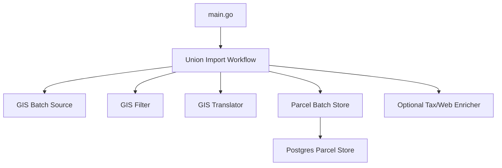

# Extract Union Import Workflow

## Goal
Move Union parcel import orchestration out of `main.go` into an app-level workflow that receives sources, translators, enrichers, and stores through dependency injection.

## Diagram

## Steps
1. Create an app-level workflow package.
   - What to do: Add `internal/app/unionimport` with a `Workflow` type and constructor that accepts its dependencies explicitly.
   - Why it's needed: `main.go` should compose dependencies and call one workflow, not own batch orchestration.
   - Risks or gotchas: Keep this package orchestration-only. Do not move Union-specific translation/fetching behavior or Postgres SQL into it.

2. Define narrow workflow dependencies.
   - What to do: Accept interfaces for the batch GIS source, record filter, parcel persister, optional enrichment, and logging.
   - Why it's needed: The workflow should depend on behavior it needs, not concrete Union/Postgres implementations.
   - Risks or gotchas: Do not introduce broad generic interfaces. Use minimal method sets shaped by the workflow.

3. Move batch import control flow from `main.go` into the workflow.
   - What to do: Move `FetchBatches` looping, batch indexing, vacant filtering, persistence call, optional enrichment call, and progress logging into `Workflow.Run(ctx)`.
   - Why it's needed: This centralizes the import use case while keeping `main.go` as composition/bootstrap.
   - Risks or gotchas: Preserve current behavior: persistence happens after GIS normalization; bad parcel insert errors are logged and do not abort the batch.

4. Move helper functions next to the workflow.
   - What to do: Move `eligibleParcelRecords` into `internal/app/unionimport`. Move `sortedParcelIDs` only if it remains workflow-specific.
   - Why it's needed: Helpers should live with the orchestration they support, not in `main.go`.
   - Risks or gotchas: If a helper becomes generally useful across import workflows, move it to a shared service package later, not now.

5. Reduce `main.go` to dependency composition.
   - What to do: Keep source/client/store construction in `main.go`, create the workflow with those dependencies, then call `Run(ctx)`.
   - Why it's needed: Composition belongs at the executable boundary; behavior belongs in testable app code.
   - Risks or gotchas: Do not hide environment parsing inside the workflow unless multiple executables need the same config behavior.

6. Add workflow tests.
   - What to do: Test the workflow through fake dependencies: batch source, persister, optional enricher, and logger.
   - Why it's needed: The workflow owns ordering and continuation semantics, so tests should verify the use case without network or database access.
   - Risks or gotchas: Avoid asserting exact log text except for meaningful error/progress signals. Prefer asserting dependency calls and summary result.

7. Return a workflow summary from `Run`.
   - What to do: Have `Run(ctx)` return totals such as batches processed, eligible parcel IDs, translated parcels, inserted parcels, and errors.
   - Why it's needed: `main.go` can print final outcomes without knowing workflow internals.
   - Risks or gotchas: Keep this summary operational, not a domain model.

## Open Questions
