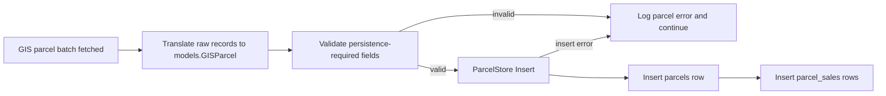

# Persist Normalized GIS Parcels

## Goal
Persist each normalized in-memory `models.GISParcel` produced from GIS parcel batches into the existing Postgres `parcels` and `parcel_sales` tables, logging invalid/uninsertable parcels without stopping the rest of the batch.

## Diagram

## Steps
1. Add a persistence boundary for normalized parcels.
   - What to do: Create a small storage-facing interface such as `ParcelStore` with `Insert(ctx context.Context, parcel *models.GISParcel) error` and `InsertBatch(ctx context.Context, parcels []*models.GISParcel) error` only if batch orchestration needs it immediately.
   - Why it's needed: The existing connector/service code already separates fetching, translating, and merging; persistence should be another explicit boundary instead of being buried inside translators or fetchers.
   - Risks or gotchas: Do not create a broad repository interface unless there is a second implementation. A concrete Postgres store plus a narrow service dependency is enough.

2. Implement a Postgres parcel store using existing `pgx/v5` dependency.
   - What to do: Add a concrete store under an internal storage package that accepts a `pgx` connection/pool-compatible executor and inserts into `parcels`, returning the generated parcel UUID for sale inserts.
   - Why it's needed: The schema already exists in `db/migrations/000001_init_schema.sql`; this task should only map `models.GISParcel` into those columns.
   - Risks or gotchas: The table has `UNIQUE (county_id, source_name, source_parcel_id)`, so “append-only” only works for new source identities. Duplicate identities should return insert errors and be logged as failed parcels for now; do not use `ON CONFLICT DO NOTHING` because later diffing needs duplicate detection to become an explicit update/no-op decision.

3. Map `models.GISParcel` fields to `parcels` columns explicitly.
   - What to do: Write a single insert statement covering identity, owner, mailing, situs, legal, land, building, valuation, geometry metadata, and `source_extras` JSONB.
   - Why it's needed: The normalized model already mirrors the table shape closely, but some names differ (`Valuation.Land` -> `valuation_land`, address sections need prefixes, etc.).
   - Risks or gotchas: `TaxOwnerID1`/`TaxOwnerID2` are `*int64` in Go but `TEXT` in the schema; convert intentionally instead of relying on driver behavior. `ParcelYear` and `YearBuilt` are `SMALLINT`; validate range before insert so bad records are logged with useful errors.

4. Persist geometry through PostGIS safely.
   - What to do: Convert `GISGeometry.Shape` to WKB/EWKB from `go-geom` and insert with `ST_SetSRID(ST_GeomFromWKB($n), $srid)` or equivalent, preserving `srid`, `source_srid`, `source_area`, and `source_length`.
   - Why it's needed: `shape` is `GEOMETRY(Geometry, 3857)` and the table check requires `ST_SRID(shape) = srid`.
   - Risks or gotchas: Current Union GIS translation sets SRID 3857. If future sources produce 4326, this plan does not add reprojection; reject/log SRID mismatches rather than silently inserting invalid geometry.

5. Insert sales as children of the inserted parcel.
   - What to do: After the parcel insert returns `id`, insert each `models.ParcelSale` into `parcel_sales` with `parcel_id` and `sequence`.
   - Why it's needed: Sale rows are normalized into a separate table with a foreign key and sequence uniqueness.
   - Risks or gotchas: `SaleYear`, `SaleMonth`, and `SaleDay` exist in the Go model but not the current table; do not persist them unless a future migration adds columns. Keep the original epoch value in `og_sale_date` and normalized date in `sale_date`.

6. Persist each fetched batch in a batch transaction with per-parcel savepoints.
   - What to do: Open one transaction per fetched batch. For each parcel, create a savepoint, insert the parcel and its sales, release the savepoint on success, or roll back to the savepoint and log the parcel error on failure. Commit the transaction after all valid parcels in the batch have been processed.
   - Why it's needed: The pipeline already fetches parcels in batches, so storage should preserve that unit of work while still allowing bad parcels to be logged without aborting the entire batch.
   - Risks or gotchas: A plain transaction for the whole batch would roll back valid parcels when one bad parcel fails. Savepoint names must be generated safely and released/rolled back consistently.

7. Wire persistence after batch fetch and normalization.
   - What to do: In the existing batch hook flow, fetch/enrich the batch, translate raw records with the existing translator(s), merge if needed, then pass the normalized parcel slice to a batch store method.
   - Why it's needed: The user flow is already batch-oriented; storage belongs after normalization, not inside `ParcelIDImportService`, `BatchEnricher`, or `GISTranslator`.
   - Risks or gotchas: `BatchEnricher` currently returns an error if any source fetch failed. If partial batch persistence is desired, keep the records returned alongside the error and log individual missing/failed parcels before deciding whether to continue. Do not decompose the existing fetched batches into per-parcel persistence calls outside the store; keep batching as the service/store contract.

8. Add focused unit tests around persistence behavior.
   - What to do: Unit test SQL argument mapping, required-field validation, duplicate unique-constraint errors being returned, source extras JSON encoding, geometry nil/non-nil handling, and sale insertion sequencing. Use a fake `pgx` executor/transaction boundary rather than a real database for unit tests.
   - Why it's needed: The task explicitly excludes migrations/schema creation; unit tests should lock down mapping and error behavior without requiring Postgres/PostGIS.
   - Risks or gotchas: Avoid testing private helpers directly if that forces exposing internals. Prefer testing the store’s public `Insert`/`InsertBatch` behavior through a fake executor that records commands and arguments.

9. Add service-level tests for batch continuation semantics.
   - What to do: Test that a batch with one valid parcel and one invalid/insert-failing parcel logs the failure and still stores the valid parcel. Test that translator errors are logged and skipped.
   - Why it's needed: The most important behavior is not pure SQL generation; it is that bad parcels do not stop the batch.
   - Risks or gotchas: Keep this at the public service boundary. Do not mock internals of translators; use simple fake translators/stores where needed.

## Open Questions
